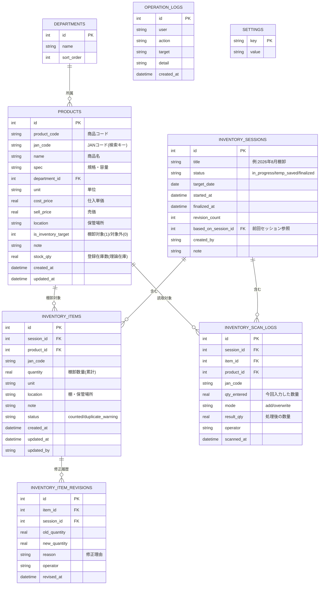
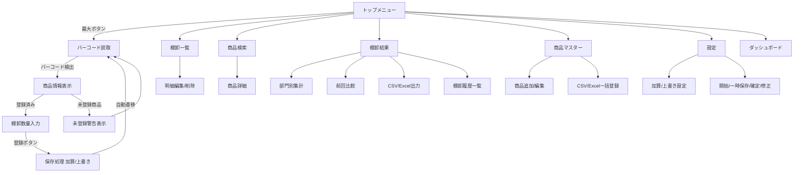
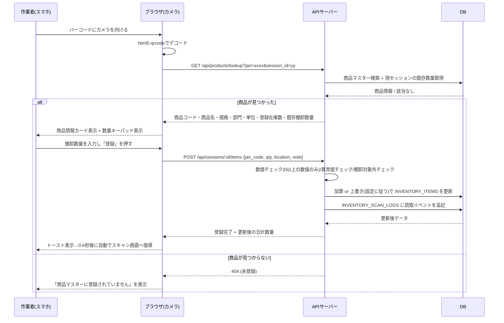

# バーコード読取式 棚卸しシステム 設計書

## 1. 全体アーキテクチャ

```
┌─────────────────────┐        HTTPS        ┌──────────────────────────┐
│  スマホ / タブレット   │ ───────────────────▶ │  Webサーバー (Node.js/Express) │
│  ブラウザ (PWA風UI)   │ ◀─────────────────── │   REST API                │
│  カメラでバーコード読取 │                      └───────────┬──────────────┘
└─────────────────────┘                                  │
┌─────────────────────┐                                  ▼
│  PC ブラウザ         │ ───────────────────▶  ┌──────────────────────────┐
│ (商品マスター管理/結果確認) │                   │  データベース (クラウドDB)   │
└─────────────────────┘                        │  PostgreSQL (Neon等)        │
                                                └──────────────────────────┘
```

* フロントエンドはスマホの標準ブラウザで動作する**Webアプリ**（アプリインストール不要）。カメラ読取には
  [html5-qrcode](https://github.com/mebjas/html5-qrcode) を使用し、JAN/EAN/CODE128等の1次元バーコードを
  ブラウザのカメラAPI(getUserMedia)経由で読み取る。
* バックエンドはNode.js + Express によるREST API。データはPostgreSQL(Neon等のクラウドDB)に保存する。
  接続先は環境変数`DATABASE_URL`で指定し、SQL発行部分は`server/db.js`に集約しているため、
  他のPostgreSQL互換サービス(Amazon RDS / Cloud SQL等)への切り替えも接続文字列の変更のみで対応できる。
* 複数端末から同時アクセスできるよう、状態はすべてサーバー側DBに保持し、クライアントはAPI経由でのみ
  読み書きする（クライアント側にローカル保存の在庫データを持たない = 端末をまたいでも一貫性を保つ）。
* 操作履歴（誰が・いつ・何を登録/修正したか）は `operation_logs` と `inventory_scan_logs` に記録し、
  データ消失防止のため全ての登録操作は都度DBにコミットする（自動保存）。バックアップ/障害復旧は
  Neon等のマネージドDBが提供するポイントインタイムリカバリ機能に委ねる構成としている。
* 将来のPOS/会計/販売管理連携を見据え、商品マスターに `product_code`（自社商品コード）と
  `jan_code`（JAN/EANコード）を分離して保持し、他システムとのコード体系の橋渡しができる設計にしている。
  また全APIはREST/JSON形式のため、外部システムからも同一APIを叩いて連携可能。

## 2. データベース設計 (ER図)



補足:
* `INVENTORY_ITEMS` は棚卸セッション内で「商品ごとに1行」持つ集約テーブル。同じバーコードを何度読んでも
  行は増えず、`quantity` を加算/上書きする。個々の読取イベント（誰が・いつ・何個入力したか）は
  `INVENTORY_SCAN_LOGS` に全件残す（監査ログ・トラブル時の追跡用）。
* `PRODUCTS.stock_qty` は理論在庫（登録在庫数）。棚卸差異 = 棚卸数量 − 理論在庫、として利用可能。
* 確定(`finalized`)後は `INVENTORY_ITEMS` を直接更新禁止。修正が必要な場合は `INVENTORY_ITEM_REVISIONS`
  に履歴を残しつつ数量を更新し、セッションの `revision_count` をインクリメントする「棚卸し修正」操作を通す。
* 前回比較は「対象部門・全体で直近の `finalized` セッション」を自動的に基準として使う
  （`based_on_session_id` で明示指定も可）。

## 3. 画面遷移設計



* **バーコード読取→登録→次の読取** は画面遷移なしで完結する「1画面ワークフロー」として実装
  （SCAN→INFO→QTY→SAVE→SCANが同一画面内でカード切り替え、片手操作を想定し主要ボタンは画面下部に大きく配置）。

## 4. 主要処理フロー（バーコード読取〜登録）



## 5. API設計（抜粋）

| メソッド | パス | 概要 |
|---|---|---|
| GET | /api/departments | 部門一覧 |
| GET | /api/products?q=&department_id= | 商品検索 |
| GET | /api/products/lookup?jan=&session_id= | バーコードで商品検索+現在の棚卸状況 |
| POST | /api/products | 商品新規登録 |
| PUT | /api/products/:id | 商品更新 |
| DELETE | /api/products/:id | 商品削除 |
| POST | /api/products/import | CSV/Excel一括登録 |
| GET | /api/sessions | 棚卸セッション履歴一覧 |
| POST | /api/sessions | 棚卸し開始(新規セッション作成) |
| GET | /api/sessions/:id | セッション詳細 |
| POST | /api/sessions/:id/save | 一時保存（ステータス更新） |
| POST | /api/sessions/:id/finalize | 棚卸し確定 |
| POST | /api/sessions/:id/items/:itemId/revise | 棚卸し修正（確定後の修正、履歴を残す） |
| GET | /api/sessions/:id/items?q= | 棚卸明細一覧・検索 |
| POST | /api/sessions/:id/items | バーコード登録（加算/上書き） |
| PUT | /api/sessions/:id/items/:itemId | 明細の手動編集(未確定時のみ) |
| DELETE | /api/sessions/:id/items/:itemId | 明細削除(未確定時のみ) |
| GET | /api/sessions/:id/results | 商品別/部門別集計・前回比較 |
| GET | /api/sessions/:id/dashboard | 進捗ダッシュボード・未棚卸一覧 |
| GET | /api/sessions/:id/export.csv | CSV出力 |
| GET | /api/sessions/:id/export.xlsx | Excel出力 |
| GET/PUT | /api/settings | 加算/上書き既定値等の設定 |
| GET | /api/logs | 操作履歴一覧 |

## 6. 画面構成（トップメニュー）

スマホ最優先。トップは6つの大型ボタン、「バーコード読取」は最大サイズ・最上部に配置。

```
┌───────────────────────────┐
│        棚卸しシステム         │
│  2026年8月棚卸(実施中)        │
├───────────────────────────┤
│ ┌─────────────────────┐ │
│ │   📷 バーコード読取     │ │ ← 最大ボタン
│ └─────────────────────┘ │
│ ┌───────────┐┌───────────┐│
│ │ 📋 棚卸一覧  ││ 🔍 商品検索  ││
│ └───────────┘└───────────┘│
│ ┌───────────┐┌───────────┐│
│ │ 📊 棚卸結果  ││ 📦 商品マスター││
│ └───────────┘└───────────┘│
│ ┌───────────┐┌───────────┐│
│ │ ⚙ 設定      ││ 📈 ダッシュボード││
│ └───────────┘└───────────┘│
└───────────────────────────┘
```

## 7. 誤入力防止・警告仕様

* 数量入力欄は `type=number, min=0, step=適切な単位刻み` とし、サーバー側でも
  `quantity >= 0` かつ数値であることを再検証（クライアント制御だけに頼らない）。
* 未登録バーコード読取時: 商品マスターに登録されていない旨を警告表示し、そのまま登録は不可
  （「商品マスターへ新規登録」ボタンから即登録可能な導線も用意）。
* 同一商品複数回読取: 設定（加算/上書き、既定=加算）に従って自動処理し、画面上に
  「前回◯個 → 今回入力△個 → 合計□個」を表示して上書きミスを防止。
* 棚卸対象外商品（`is_inventory_target=0`）を読み取った場合は警告バナーを表示し、
  登録するには確認操作を要求。
* 異常値チェック: 登録在庫数の一定倍率（既定5倍、設定変更可）を超える数量が入力された場合、
  「本当にこの数量でよろしいですか？」の確認ダイアログを表示。

## 8. 技術スタック

| 層 | 技術 |
|---|---|
| フロントエンド | HTML/CSS/Vanilla JS (SPA, hashルーティング), html5-qrcode (カメラバーコード読取) |
| バックエンド | Node.js + Express |
| DB | PostgreSQL (Neon等のクラウドDB、`pg`ドライバ経由で接続) |
| ホスティング | Render等のPaaS（GitHub連携でデプロイ、HTTPS自動付与） |
| CSV/Excel | xlsx (SheetJS) |
| 認証(拡張余地) | 本デモは簡易操作者名入力。本番はSSO/IDプロバイダ連携を想定 |

## 9. 将来拡張（POS/会計/販売管理連携）

* 商品マスターに外部連携キー(`product_code`)を保持済み。
* 全機能をREST APIとして実装しているため、他システムからのAPI呼び出し・Webhook追加が容易。
* `inventory_sessions`確定時に会計システム向け仕訳データ（棚卸差異計上）を出力するAPIを
  将来的に追加できる設計。
